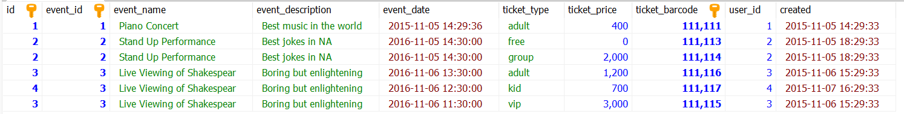
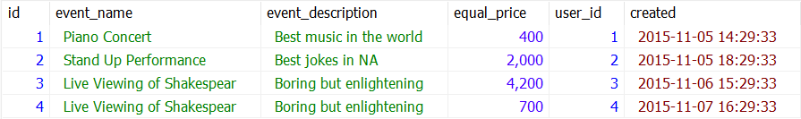

# Тестовое задание

## I. Вёрстка

### 1) Верстка блока

Код находится в этом репозитории. Технологии: Vite, React, Tailwind
Сайт: https://nickgrief.github.io/nevatrip-test-2/

### 2) Таблица на странице

Наивное решение используя CSS параметр, позволяющий словам переходить на следующие строчки без ограничений.

` table {
    word-break: break-word;
}`

Ссылка на CodePen: https://codepen.io/nickgrief/pen/wvjLVLR

Другие потенциальные решения:
* Переписать таблицу используя grid или flexbox
* "Упаковать" таблицу в div с overflow-x: scroll. 
* Изменять параметры таблицы под разные размеры экранов.

## II. JavaScript

### 1) Билет на событие

#### Диаграмма финальной базы данных:


#### Объяснение решения

Используя MySQL, я создал базу данных, в которой распределил необходимые нам данные по таблицам так, чтобы они не повторялись в двух таблицах. 

Для решения задачи №1 я создал отдельную таблицу с типами билетов. В таблице цен цена билета привязывается к типу билета и типу события. Таким образом, у каждого типа события могут быть свои типы билетов и цены на них.

Для решения задачи №2 я создал отдельную таблицу, описывающую каждый купленный билет. Каждый билет имеет свой баркод, привязан к определенному заказу, дате события и типу билета. Таким образом каждый билет существует как отдельная единица, клиенты могут покупать, использовать и возвращать их по отдельности.

#### Выборка по отдельным билетам

```
SELECT orders.order_id AS id, event_type.type_id AS event_id,
event_type.NAME as `event_name`, event_type.DESCRIPTION as `event_description`,
event_dated.DATE AS `event_date`, ticket_type.`type` AS ticket_type,
price.price AS ticket_price, ticket.barcode AS ticket_barcode, orders.user_id, orders.created FROM orders 
INNER JOIN ticket ON orders.order_id = ticket.order_id
INNER JOIN ticket_type ON ticket.ticket_type_id = ticket_type.ticket_type_id
INNER JOIN event_dated ON ticket.event_dated_id = event_dated.event_dated_id
INNER JOIN event_type ON event_dated.event_type_id = event_type.type_id
INNER JOIN price
   ON ((event_type.type_id = price.event_type_id)
       AND (ticket.ticket_type_id = price.ticket_type_id))
```



#### Подсчет полной цены заказа

```
SELECT orders.order_id AS id,
event_type.NAME as `event_name`, event_type.DESCRIPTION as `event_description`,
sum(price.price) AS equal_price,
 orders.user_id, orders.created FROM orders 
INNER JOIN ticket ON orders.order_id = ticket.order_id
INNER JOIN ticket_type ON ticket.ticket_type_id = ticket_type.ticket_type_id
INNER JOIN event_dated ON ticket.event_dated_id = event_dated.event_dated_id
INNER JOIN event_type ON event_dated.event_type_id = event_type.type_id
INNER JOIN price
   ON ((event_type.type_id = price.event_type_id)
       AND (ticket.ticket_type_id = price.ticket_type_id))
       
GROUP BY id
```




### 2) Время из A в B

Код: https://github.com/nickgrief/nevatrip-js
Сайт: https://nickgrief.github.io/nevatrip-js/

Технологии: Vite, TypeScript, React, Tailwind


